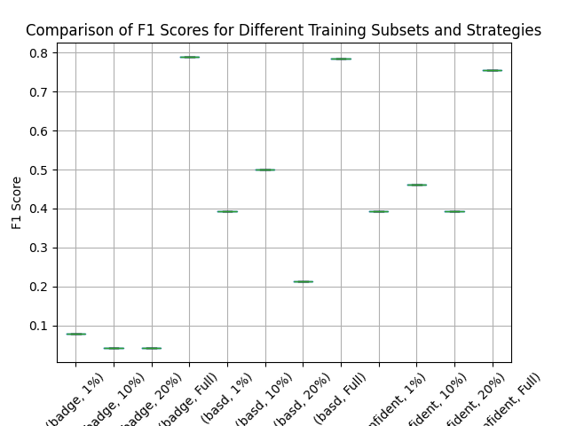

# Курсовая работа
## Интеллектуальные системы и технологии

## О проекте

Этот репозиторий содержит курсовую работу студентов 2 курса магистратуры МАИ, группы М8О-209М-23: Баклашкина Алексея и Лыгуна Кирилла. 

 Работа посвящена исследованию алгоритмов активного обучения в задачах машинного обучения.
 В рамках работы были реализованы три алгоритма активного обучения:
 1. Badge Sampling
 2. Bald Sampling
 3. Least Confidence Sampling

## Содержание

- [Загрузка](#Загрузка)
- [Датасет](#датасет)
- [Описание](#описание)
- [Результаты](#результаты)


## Загрузка

1. Клонируйте репозиторий:
    ```sh
    git clone https://github.com/lassiezfaire/data-analysis-term-paper.git
    cd data-analysis-term-paper
    ```

2. Создайте виртуальное окружение conda с помощью файла `environment.yml`:
    ```sh
    conda env create -f environment.yml
    ```

## Датасет

Iris — это один из самых известных и часто используемых датасетов в области машинного обучения и статистики. Он был представлен Рональдом Фишером в 1936 году и содержит данные о трех видах ирисов (Iris setosa, Iris versicolor и Iris virginica).

## Описание

- Датасет Iris загружается из библиотеки scikit-learn.

- Данные разделяются на обучающий и тестовый наборы с использованием train_test_split из scikit-learn.

- Испольются три стратегии активного обучения:
-- Least Confidence (LC): Выбирает примеры, для которых модель наименее уверена в своих предсказаниях.
-- BALD: Выбирает примеры на основе ожидаемой информации.
-- BADGE: Выбирает примеры на основе градиентов предсказаний.

- Качество моделей оценивается по метрике F1. Проводится по 5 проверок для каждого обучения на тестовом датасете.

- Результаты отображаются в виде графика, который сохраняется в файл f1_scores_comparison.png.

## Результаты

